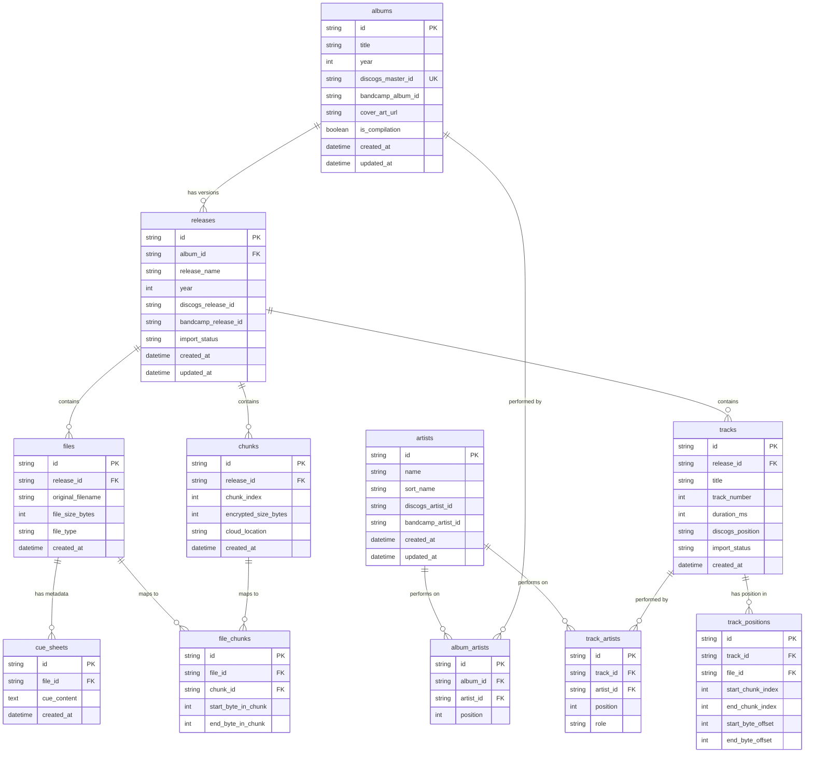
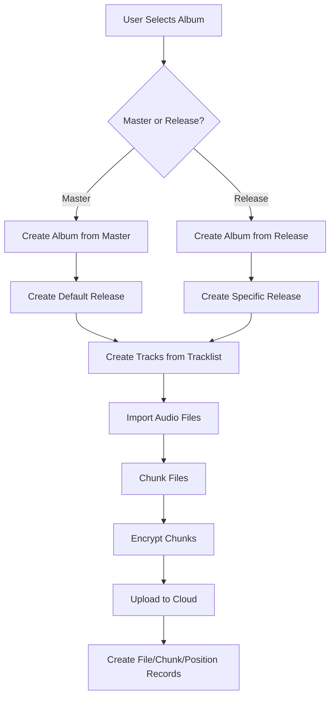
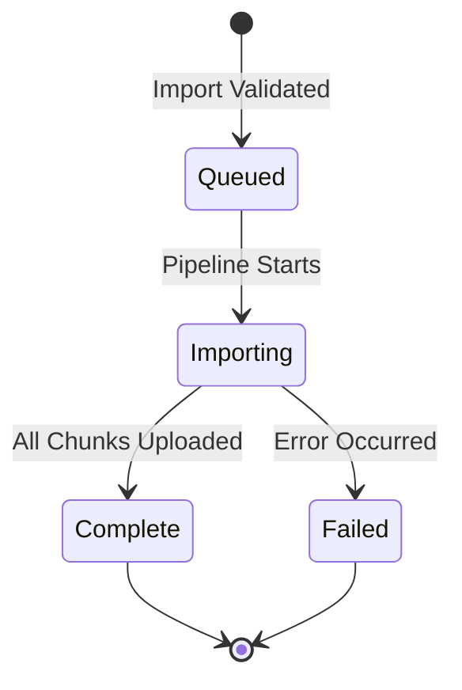
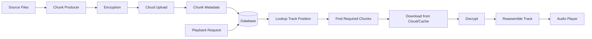

# bae Database Schema

This document describes the SQLite database schema used by bae for managing music library metadata.

## Overview

bae uses a relational schema that separates logical albums from physical releases, allowing multiple versions of the same album (remasters, different pressings, etc.) to coexist in the library.

## Entity Relationship Diagram



## Core Concepts

### Albums vs Releases

**Albums** represent logical/abstract albums (Discogs "masters"):
- The Rock Band - Greatest Hits
- Jazz Ensemble - Live Sessions

**Releases** represent specific versions/pressings:
- Greatest Hits (1973 Original UK Pressing)
- Greatest Hits (2016 Remaster)
- Live Sessions (1969 Original)
- Live Sessions (2019 Anniversary Mix)

This separation allows:
- Multiple versions of the same album in your library
- Tracking which specific pressing your files represent
- Sharing album-level metadata (title, artists) across releases

### Import Flow



## Table Descriptions

### `albums`

Logical albums (the "master" concept). One album can have multiple releases.

**Unique Constraints:**
- `discogs_master_id` (if set) - prevents duplicate imports of the same Discogs master

**Key Fields:**
- `discogs_master_id`: Links to Discogs master release (set for both master and release imports)
- `is_compilation`: True for "Various Artists" albums

### `releases`

Specific versions/pressings of albums. All audio data belongs to releases.

**Unique Constraints:**
- `(album_id, discogs_release_id)` - prevents duplicate imports of the same Discogs release
- `(album_id, bandcamp_release_id)` - prevents duplicate imports of the same Bandcamp release

**Note:** Multiple releases with NULL `discogs_release_id` are allowed (multiple master imports).

**Key Fields:**
- `album_id`: Links to parent album
- `discogs_release_id`: Set only when importing a specific Discogs release (NULL for master imports)
- `release_name`: Human-readable version name (e.g., "2016 Remaster")
- `import_status`: `queued`, `importing`, `complete`, or `failed`

### `tracks`

Individual tracks within a release. Track listings can differ between releases.

**Key Fields:**
- `release_id`: Tracks belong to releases, not albums
- `track_number`: Sequential number (1, 2, 3...)
- `discogs_position`: Original position from metadata (e.g., "A1", "B2" for vinyl)
- `import_status`: Tracks can complete independently as chunks upload

### `files`

Physical files belonging to a release. Can be audio files or metadata files.

**File Types:**
- Audio: FLAC, MP3, WAV, M4A, AAC, OGG
- Metadata: CUE sheets, cover art, logs

**Relationships:**
- One file can contain multiple tracks (CUE/FLAC: entire album in one file)
- One file can span multiple chunks (large files are split)
- Metadata files (cover.jpg, .cue) have no track associations

### `chunks`

Fixed-size encrypted chunks stored in cloud storage.

**Key Properties:**
- Default size: 1MB (configurable)
- Encrypted with AES-256-GCM before upload
- Stored in S3 with hash-based partitioning
- Cached locally with LRU eviction

**Relationships:**
- One chunk can contain data from multiple files (small files packed together)
- One chunk can contain data from multiple tracks (when files share chunks)

### `file_chunks`

Junction table mapping files to chunks with byte offsets.

**Purpose:**
- Tracks which chunks contain which file's data
- Stores byte offsets within chunks for precise reconstruction
- Enables efficient file reassembly during playback

### `track_positions`

Tracks where each track's audio data lives within files.

**Use Cases:**

**Individual Files (1 file = 1 track):**
```
Track 1 → File 1 (entire file)
Track 2 → File 2 (entire file)
```

**CUE/FLAC (1 file = entire album):**
```
Track 1 → File 1 (bytes 0-15,000,000)
Track 2 → File 1 (bytes 15,000,000-32,000,000)
Track 3 → File 1 (bytes 32,000,000-48,000,000)
```

**Key Fields:**
- `start_chunk_index`, `end_chunk_index`: Which chunks contain this track
- `start_byte_offset`, `end_byte_offset`: Precise byte positions within chunks

### `cue_sheets`

CUE sheet metadata for disc images.

**Purpose:**
- Stores original CUE sheet content
- Used for track boundary information
- Preserved for future re-imports or format conversions

### `artists`

Artist metadata with support for multiple metadata sources.

**Deduplication:**
- Artists are deduplicated by `discogs_artist_id` across imports
- Prevents duplicate artist records when importing multiple albums by the same artist

### `album_artists` & `track_artists`

Junction tables linking artists to albums and tracks.

**Key Features:**
- `position`: Maintains artist order for multi-artist releases
- `role` (tracks only): Distinguishes main artist, featured artist, remixer, etc.

## Import Status Flow



**Status applies to:**
- Releases (overall import status)
- Tracks (individual track completion)

**Track Completion:**
- Tracks are marked `complete` as soon as all their chunks upload
- Enables progressive playback while import is still running
- UI can show per-track progress

## Data Flow: Import to Playback



## Schema Evolution

The schema is designed for future extensibility:

**Multi-source Support:**
- `discogs_*` and `bandcamp_*` fields allow multiple metadata sources
- New sources can be added without schema changes

**Multiple Releases:**
- Albums can have unlimited releases
- Each release maintains independent audio files and metadata

**Format Flexibility:**
- Files table supports any audio format
- CUE sheets stored separately for disc images
- Chunk-based storage works with any file type

## Constraints Summary

| Table | Constraint | Purpose |
|-------|-----------|---------|
| `albums` | `UNIQUE(discogs_master_id)` | Prevent duplicate master imports |
| `releases` | `UNIQUE(album_id, discogs_release_id)` | Prevent duplicate release imports |
| `releases` | `UNIQUE(album_id, bandcamp_release_id)` | Prevent duplicate Bandcamp imports |
| `album_artists` | `UNIQUE(album_id, artist_id)` | One artist appears once per album |
| All tables | `FOREIGN KEY ... ON DELETE CASCADE` | Clean up related records |

**Note:** NULL values in UNIQUE constraints allow multiple rows (SQLite behavior). This means multiple master imports (NULL `discogs_release_id`) for the same album are permitted.

